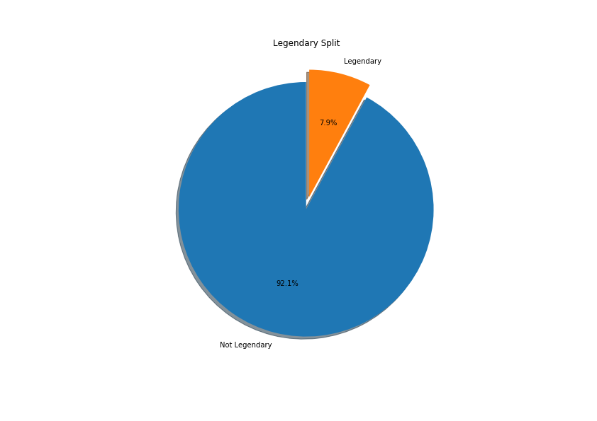
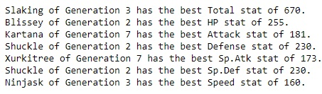
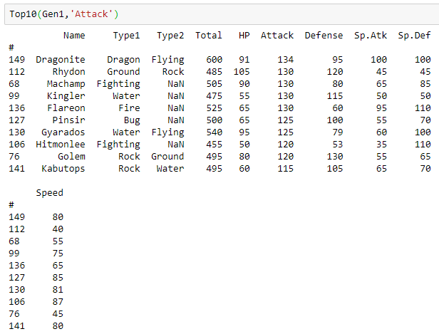

# DESAFIOS

1. Utilizando o arquivo **dados.csv**, fazer um gráfico de barras que realize a contagem do número de imóveis em cada bairro

2. Utilizando o arquivo **dados.csv**, fazer o cálculo do preço médio dos imóveis, separando-os por quarto

3. Utilizando o arquivo **dados.csv**, realizar um gráfico de pizza onde mostre a proporção dos imóveis com mais de 80m² de área.

4. Utilizando o arquivo **pokemon.csv**, realizar um gráfico de pizza que mostre a proporção percentual entre os pokémons lendários e não lendários

Saída esperada:



* Código de apoio

```python
LegendPie = plt.pie(LSplit,labels= ['Not Legendary', 'Legendary'], autopct ='%1.1f%%', shadow = True, startangle = 90,explode=(0, 0.1))
plt.title('Legendary Split',fontsize = 12)
fig = plt.gcf()
fig.set_size_inches(11.7,8.27)
plt.savefig("LegendPie.png")
```

5. Utilizando o arquivo **pokemon.csv**, criar uma função onde mostre o pokémon não lendário mais forte em cada stat para cada geração

Saída esperada:



6. Utilizando o arquivo **pokemon.csv**, criar uma função que receba como parâmetros a geração e o stat e exiba os 10 melhores pokemons.

Saída esperada:



Respostas

[\[1-3]](Desafios/desafio_(dados).ipynb)

[\[4-6]](https://github.com/neilprado/kung_fu_Pandas/blob/master/Desafios/response.md)
